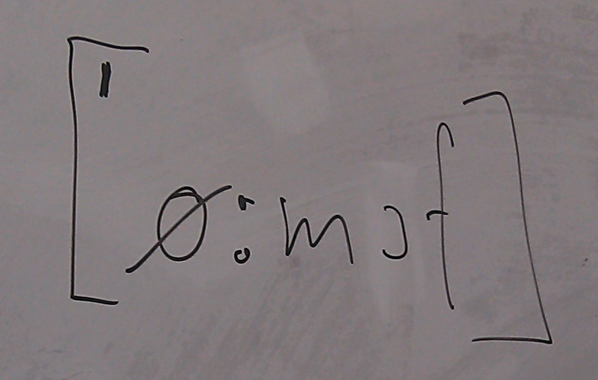

---
author:
 - "@uvchik"
 - "@gplssm"
 - "@c-moeller"
title: "5 years of oemof development"
classoption: aspectratio=169
date: December 4, 2019
institute: 10th oemof dev meeting
header-includes:
 - |
   \usepackage{tikz}
---

# {.plain}

\center\Huge What happened on December 4th 2014?

---

\center
\includegraphics[page=1,width=\paperwidth]{fig/Slide_1.pdf}

---

\center

Gibt es noch ein Bild von dem Gründungstreffen?

---

\center
\includegraphics[page=1,width=\paperwidth]{fig/Slide_2.pdf}

---

\center
\includegraphics[page=1,width=\paperwidth]{fig/Slide_3.pdf}

---

\center
\includegraphics[page=1,width=\paperwidth]{fig/Slide_4.pdf}

---

\center
\includegraphics[page=1,width=\paperwidth]{fig/Slide_5.pdf}

---

\center
\includegraphics[page=1,width=\paperwidth]{fig/Slide_6.pdf}

---

\center
\includegraphics[page=1,width=\paperwidth]{fig/Slide_7.pdf}

---

\center
\includegraphics[page=1,width=\paperwidth]{fig/Slide_9.pdf}

---

\center
\includegraphics[page=1,width=\paperwidth]{fig/Slide_12.pdf}

---

\center
\includegraphics[page=1,width=\paperwidth]{fig/Slide_13.pdf}

---

\center
\includegraphics[page=1,width=\paperwidth]{fig/Slide_14.pdf}

---

\center
\includegraphics[page=1,width=\paperwidth]{fig/Slide_15.pdf}

# Wir fuhren mit _pahesmf_ nach Flensburg und kamen zurück mit

\center
{ width=75% }

# {.plain}

\center\Huge On the way towards v0.0.1

# {.plain}

\center\Huge The great refactoring: v0.1.0

# {.plain}

\center\Huge Development post v0.1.0 focused on code quality

# {.plain}

\center\Huge Some statistics from the git repository

# More and more contributors joined over time

\center
{ width=85% }

# {.plain}

# {.plain}

\center\Huge Who's working when?

# 9-to-5er

# 17/7

# Late night hero

# Not on Fridays

# Earliest commit ever?

# Off the working hours

# {.plain}

\begin{tikzpicture}[remember picture, overlay]
\node at (current page.center) {\includegraphics[width=\paperwidth,height=\paperheight,keepaspectratio]{fig/oemof_timeline.pdf}};
\node<2->[fill=white,opacity=.95,text opacity=1, inner sep=1.2cm] at (current page.center) {\Huge Thanks for contributing!};
\end{tikzpicture}

