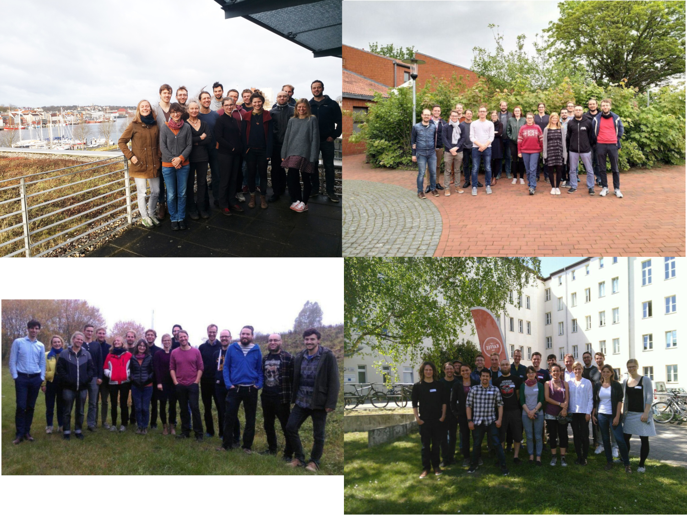

---
author:
 - "@uvchik"
 - "@gplssm"
 - "@c-moeller"
title: "5 years of oemof development"
classoption: aspectratio=169
titlegraphic: '`fig/logo_oemof_website_big.png`{=latex}'
date: December 4, 2019
institute: 10th oemof dev meeting
header-includes:
 - |
   \usepackage{tikz}
---

What do you know about oemof's history?

* Build groups of 2-4 members
* Take A,B,C,D - sheets for each group
* Close your notebook and put your smartphone in your bag - no cheating!

___

# {.plain}

\center\Huge What happened on December 4th 2014?

---

\center
\includegraphics[page=1,width=\paperwidth]{fig/IMG_0017.JPG}

---

What happened on December 4th 2014?

* A: The initial commit of the oemof repository was created
* B: The oemof foundation meeting was held
* C: A presentation was held about collaborative working in the field of energy modelling.
* D: The decision was taken to found oemof

---

What happened on December 4th 2014?

* A: The initial commit of the oemof repository was created
* B: The oemof foundation meeting was held
* C: **A presentation was held about collaborative working in the field of energy modelling.**
* D: The decision was taken to found oemof

---

\center
\includegraphics[page=1,width=\paperwidth]{fig/Slide_1.pdf}

---

Which model did NOT inspire oemof

* A: renpass
* B: NooDEl
* C: MR Esom
* D: reegis_hp

---

Which model did NOT inspire oemof

* A: renpass
* B: **NooDEl**
* C: MR Esom
* D: reegis_hp

---

\center
\includegraphics[page=1,width=\paperwidth]{fig/Slide_2.pdf}

---

\center
\includegraphics[page=1,width=\paperwidth]{fig/Slide_3.pdf}

---

\center
\includegraphics[page=1,width=\paperwidth]{fig/Slide_5.pdf}

---

\center
\includegraphics[page=1,width=\paperwidth]{fig/Slide_7.pdf}

---

\center
\includegraphics[page=1,width=\paperwidth]{fig/Slide_12.pdf}

---

\center
\includegraphics[page=1,width=\paperwidth]{fig/Slide_13.pdf}

---

\center
\includegraphics[page=1,width=\paperwidth]{fig/Slide_14.pdf}

---

\center
\includegraphics[page=1,width=\paperwidth]{fig/Slide_15.pdf}

---

# We drove to Flensburg with _pahesmf_  and returned with

\center
{ width=75% }

---

# {.plain}

\center\Huge On the way towards v0.0.1

---

# {.plain}

What was the first package published?

* A: feedinlib
* B: outputlib
* C: solph
* D: oemof

---

What was the first package published?

* A: **feedinlib**
* B: outputlib
* C: solph
* D: oemof

---

\center\Huge Extra: What was the first version number and why?

---

# Work on the first oemof (solph) release

\center
{ width=70% }

---

What was the name of the first release package?

* A: oemof_core
* B: oemof_network
* C: oemof_solph
* D: oemof_base

---

What was the name of the first release package?

* A: oemof_core
* B: oemof_network
* C: oemof_solph
* D: **oemof_base**

---

# Release party (guys)

\center
{ width=70% }

---

# Release party (girls)

\center
{ width=70% }

---

\center\Huge The great refactoring: v0.1.0

# {.plain}

What was NOT released in autumn 2016

* A: oemof v0.1.0
* B: feedinlib v0.0.11
* C: windpowerlib v0.0.1
* D: demandlib v0.1.0

---

What was NOT released in autumn 2016

* A: oemof v0.1.0
* B: feedinlib v0.0.11
* C: **windpowerlib v0.0.1** -> August 2016 :-) 
* D: demandlib v0.1.0

---

What was totally new in v0.1.0?

* A: Investment mode
* B: Additional constraints
* C: Flow class
* D: EnergySystem class

---

What was totally new in v0.1.0?

* A: Investment mode
* B: Additional constraints
* C: **Flow class**
* D: EnergySystem class

---

\center\Huge Development post v0.1.0 focused on code quality and new features

---

Which oemof release took the longest?

* A: v0.0.1
* B: v0.2.0
* C: v0.5.2
* D: v0.1.0

---

Extra point: Which package came up next?

---

**TESPy**

---

When was the initial commit of TESPy?

* A: 06/2016
* B: 12/2016
* C: 06/2017
* D: 12/2017

---

When was the initial commit of TESPy?

* A: 06/2016
* B: 12/2016
* C: 06/2017
* D: **12/2017**

---

# The first user meeting in May 2017

{ width=100% }

---

How many books exist about oemof?

* A: No real book
* B: A chaotic collection of concept papers published as a book
* C: A Springer book but nobody knows how this could ever pass the review
* D: An english book but in Latin it would have been at least funny

---

How many books exist about oemof?

* A: **No real book**
* B: **A chaotic collection of concept papers published as a book**
* C: **A Springer book but nobody knows how this could ever pass the review**
* D: **An english book but in Latin it would have been at least funny**

---

# The meetings from 12/2017 to 05/2019

{ width=100% }

---

\center
{ width=100% }

# {.plain}

\center\Huge Some statistics from the git repository

---

How many contributors committed to oemof's code base until now?

* A: 13
* B: 42
* C: 28
* D: 31

---

How many contributors committed to oemof's code base until now?

* A: 13
* B: 42
* C: 28
* D: **31**

---

# More and more contributors joined over time

\center
{ width=85% }

---

# {.plain}

---

# {.plain}

\center\Huge Who's working when?

---

# 9-to-5er

---

# 17/7

---

# Late night hero

---

# Not on Fridays

---

# Earliest commit ever?

---

# Off the working hours

---

# {.plain}

\begin{tikzpicture}[remember picture, overlay]
\node at (current page.center) {\includegraphics[width=\paperwidth,height=\paperheight,keepaspectratio]{fig/oemof_timeline.pdf}};
\node<2->[fill=white,opacity=.95,text opacity=1, inner sep=1.2cm] at (current page.center) {\Huge Thanks for contributing!};
\end{tikzpicture}

